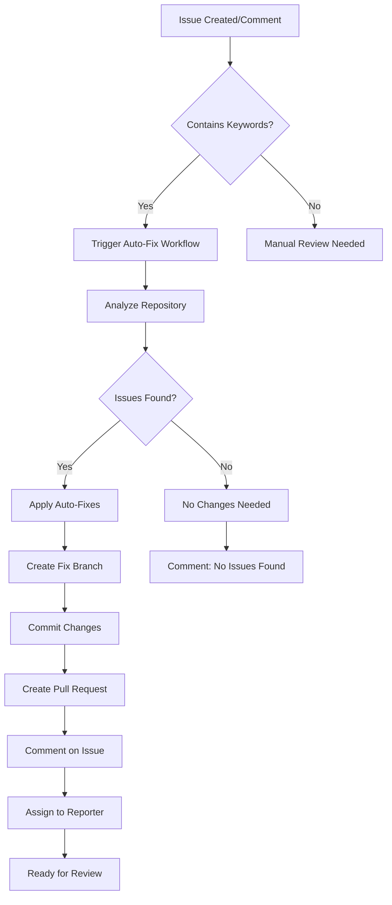

# 🤖 Auto-Fix GitHub Issues

This repository includes comprehensive auto-fix capabilities that can automatically resolve common issues through GitHub Actions workflows.

## ✨ Features

### 📦 Auto-Fix Categories

1. **Dependencies** (`autofix.yml`)
   - Update outdated dependencies
   - Fix go.mod conflicts
   - Regenerate go.sum
   - Auto-handle version mismatches

2. **Code Quality** (`autofix.yml`)
   - Fix formatting issues with gofmt
   - Resolve golangci-lint warnings
   - Fix import organization
   - Remove unused dependencies

3. **Security** (`autofix-security.yml`)
   - Update vulnerable dependencies (govulncheck)
   - Fix gosec security issues
   - Auto-apply security best practices
   - Generate security audit reports

4. **Performance** (`autofix-performance.yml`)
   - Optimize memory allocations
   - Add parallel execution to tests
   - Fix memory leaks
   - Optimize string operations

5. **Build Issues** (`autofix-build.yml`)
   - Analyze and fix compilation failures
   - Auto-retry failed builds after fixes
   - Fix syntax errors
   - Handle Go version mismatches

## 🚀 How to Use

### 1. Issue-Based Triggers

Create an issue with any of these keywords in the title or body:

```markdown
dependency, go.mod, version conflict
formatting, gofmt, code style
lint, golangci, code quality  
import, unused import
security, vulnerability, gosec
performance, slow, memory, optimization
build, compilation, error
```

### 2. Comment Commands

Comment on any issue with these commands:

```bash
/fix-deps          # Fix dependency issues
/fix-format        # Fix code formatting
/fix-lint          # Fix linting issues  
/fix-imports       # Fix import issues
/fix-security      # Fix security vulnerabilities
/fix-performance   # Apply performance optimizations
/fix-build         # Fix build compilation issues
```

### 3. Issue Templates

Use the **🤖 Auto-fix Request** template in the issue creation UI for systematic auto-fix requests.

### 4. Automated Triggers

- **Scheduled Runs**: Security scans daily, performance audits weekly
- **Build Failures**: Auto-triggered when build workflows fail
- **New Issues**: Auto-triggered when issues with relevant keywords are created

## 🔧 Workflow Process



## 📋 Available Workflows

| Workflow | Trigger | Fixes Applied |
|----------|---------|---------------|
| `autofix.yml` | Issues, Comments, Schedule | Dependencies, Formatting, Imports, Linting |
| `autofix-security.yml` | Security Issues, Comments, Schedule | Vulnerabilities, Security Patterns |
| `autofix-performance.yml` | Performance Issues, Comments, Schedule | Memory, Goroutines, Optimizations |
| `autofix-build.yml` | Build Failures, Comments | Compilation, Syntax, Go Version |

## 🛡️ Safety Features

- **Review Required**: All auto-fix PRs still need human review
- **Backup Branches**: Original code preserved in main branch
- **Gradual Changes**: Only applies safe, proven fixes
- **Logging**: All actions documented and traceable
- **Rollback Ready**: Easy to reject and revert changes

## 📊 Monitoring & Metrics

The auto-fix system tracks:

- ✅ Issues automatically resolved
- 🔄 Success rate of auto-fixes
- 📈 Time saved on manual fixes
- 🛡️ Security improvements applied
- ⚡ Performance optimizations implemented

## 🎯 Best Practices

### For Users

1. **Good Issue Titles**: Include relevant keywords
2. **Detailed Descriptions**: Provide context and error logs
3. **Specific Commands**: Use comment commands for targeted fixes
4. **Review PRs**: Always review auto-generated PRs
5. **Provide Feedback**: Help improve the auto-fix system

### For Maintainers

1. **Monitor**: Watch auto-fix success rates
2. **Customize**: Tailor fixes to project needs
3. **Test**: Validate auto-fixes in development
4. **Update**: Keep security tools and patterns current
5. **Document**: Maintain clear fix strategies

## 🎨 Customization

### Adding New Auto-Fix Patterns

Edit the relevant workflow file to add new detection patterns:

```yaml
- name: Custom Fix
  if: contains(github.event.issue.body, 'custom-issue')
  run: |
    # Your custom fix logic here
    echo "Applying custom fix..."
```

### Modifying Triggers

Update workflow `on:` sections to customize when fixes run:

```yaml
on:
  issues:
    types: [opened, edited, labeled]
  schedule:
    - cron: "0 2 * * *"  # Daily at 2 AM UTC
```

### Adjusting Safety Checks

Modify conditions and validation steps as needed:

```yaml
- name: Validate Fix
  run: |
    # Add your validation logic
    go test ./...
    go vet ./...
```

## 🔒 Security Considerations

- **Token Permissions**: Minimal required permissions only
- **Code Review**: All changes require human review
- **Audit Trail**: Complete logging of all auto-fixes
- **Rate Limiting**: Prevents abuse and excessive API calls
- **Validation**: Built-in safety checks before applying fixes

## 📞 Support

If the auto-fix system doesn't resolve your issue:

1. Check the auto-fix PR comments for details
2. Review the workflow logs in the Actions tab
3. Comment with `/manual` to disable auto-fix for specific issues
4. Create a new issue with detailed information

---

🤖 **Auto-fix systems are here to help, not replace human judgment. Always review automated changes carefully!**